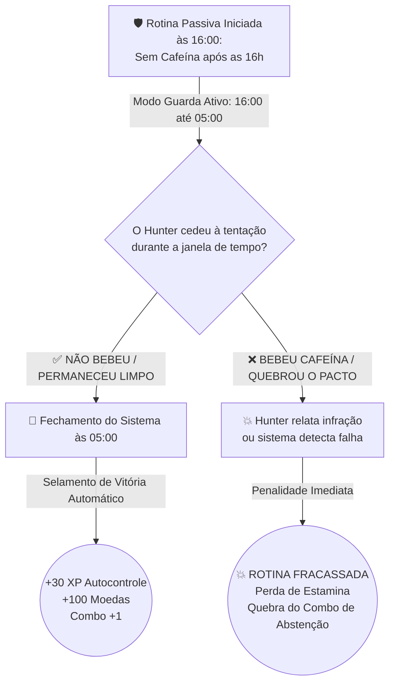
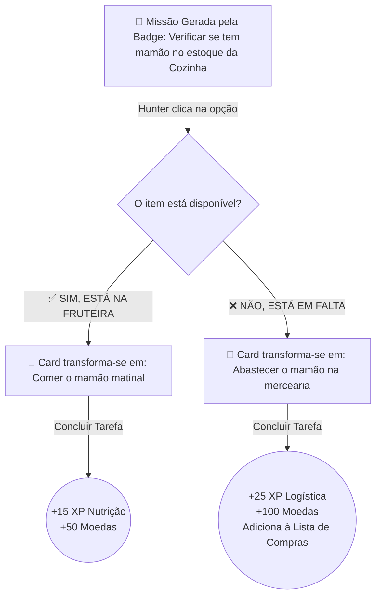

# 📊 PLANO ESTRATÉGICO DE VALOR DE MERCADO & ARQUITETURA DE GAMIFICAÇÃO AVANÇADA
**Projeto:** Solo Rotinas (Solo Routines SaaS)  
**Data:** Julho de 2026  
**Classificação:** S-Rank (Fable Method — Visão de Produto, Economia e Engenharia)

---

## 1. ANÁLISE GERAL DE VALOR DE MERCADO & POSICIONAMENTO SAAS

### 🌐 O Cenário Global de Produtividade & Gamificação
O mercado global de aplicativos de gestão de hábitos, produtividade e gamificação de estilo de vida (liderado por plataformas como *Habitica*, *Finch*, *Notion*, *Duolingo* e *Strava*) ultrapassou a marca de **US$ 10 bilhões anuais**, com projeção de crescimento de 14% ao ano. No entanto, uma análise crítica revela o maior problema desse setor: **a taxa de abandono (churn) após 60 dias é superior a 90%**.

**Por que 90% dos aplicativos falham?**
1. **Recompensas Superficiais e Infantis:** Ganhar "moedinhas virtuais" ou ver um avatar 2D pixelado pular perde o apelo psicológico em poucas semanas. Falta *prestígio*, *escassez real* e *cerimônia*.
2. **Rigidez Biocrática (O Paradoxo do Checklist):** A vida real é dinâmica e cheia de imprevistos. Quando o usuário falha um hábito por motivo de força maior (ex: choveu e não deu para correr; faltou um ingrediente na cozinha), os checklists tradicionais punem o usuário com quebra de ofensiva (streak), gerando frustração e abandono.
3. **Ausência de Economia Social e Liquidez:** O esforço do usuário fica isolado em um banco de dados local. Não há valor de troca, não há mercado e não há sensação de patrimônio construído.
4. **Viés de Ação Positiva (Ignora o Autocontrole):** Apps comuns só monitoram o que o usuário *faz* (ex: beber água, treinar), ignorando que metade da disciplina humana é feita de **Abstenção e Guarda Passiva** (ex: *não* beber café à noite, *não* gastar impulsivamente, *não* usar redes sociais antes de dormir).

---

### 🚀 O Diferencial Competitivo S-Rank do Solo Rotinas
O Solo Rotinas se posiciona não como um simples "organizador de tarefas", mas como um **Sistema Operacional Gamificado de Alta Odisséia**, inspirado na estética de poder de RPGs coreanos (como *Solo Leveling*). Nossa proposta de valor ataca diretamente as lacunas do mercado através de cinco pilares revolucionários:

```
+-----------------------------------------------------------------------------------+
|                        ECOSSISTEMA SOLO ROTINAS (S-RANK)                          |
+-----------------------------------------------------------------------------------+
|  1. ECONOMIA DE ESCASSEZ (Loot & Trade)                                           |
|     -> Dungeons diárias geram drops com probabilidades até 0,01% (Mítico).         |
|     -> Casa de Trocas P2P: disciplina convertida em ativos digitais de alto valor.|
+-----------------------------------------------------------------------------------+
|  2. RELÍQUIAS FUNCIONAIS (Equipamentos com Poderes)                               |
|     -> Badges deixam de ser vaidade cosmética e tornam-se hardware de RPG.        |
|     -> Buffs de XP, multiplicadores de Mana, estatuto VIP e permissões de Masmorra|
+-----------------------------------------------------------------------------------+
|  3. ROTINAS ADAPTATIVAS (Motores Booleanos / Condicionais)                        |
|     -> Árvores de decisão em tempo real: "Tem mamão no estoque?"                  |
|     -> Sim -> "Comer mamão" | Não -> "Abastecer mamão na mercearia".               |
+-----------------------------------------------------------------------------------+
|  4. ROTINAS PASSIVAS DE ABSTENÇÃO (Modo Guarda / Escudo de Autocontrole)          |
|     -> Monitoramento de hábitos negativos por janela de tempo (ex: Sem Cafeína    |
|        das 16:00 às 05:00). Sobreviver ao período sela a vitória automática!      |
+-----------------------------------------------------------------------------------+
|  5. BADGES GERADORAS DE MISSÕES (Sinergia de Equipamento e Conteúdo)              |
|     -> Equipar relíquias específicas destrava cadeias exclusivas de missões       |
|        booleanas de nutrição, treino hardcore ou abstenção estoica.               |
+-----------------------------------------------------------------------------------+
```

---

## 2. AVALIAÇÃO ESTRATÉGICA DE MONETIZAÇÃO: O DILEMA DA "COMPRA DENTRO DE COMPRA"

### ⚠️ O Risco Psicológico (A Frustração do Assinante VIP)
Uma ideia brilhante para expandir o ecossistema é criar **Badges Funcionais Compraveis que Geram Missões Booleanas e Especiais** (ex: comprar a "Relíquia do Alquimista" destrava o módulo de missões condicionais de cozinha e nutrição). 

No entanto, em SaaS e jogos modernos, o maior erro estratégico é o **"Double-Dipping" (Cobrar dentro da cobrança)**. Se um usuário que já paga a assinatura mensal VIP (*Fênix Pioneira*) se deparar com uma barreira paga (paywall em dinheiro real / R$) para adquirir uma Badge e destravar novas missões, ele sentirá:
- *Alienação e Quebra de Confiança:* "Eu já pago a assinatura premium e ainda preciso gastar dinheiro extra para ter acesso a funções básicas ou missões?"
- *Cancelamento Imediato (Churn):* Sentimento de ganância por parte da plataforma.

---

### 🛡️ A Solução S-Rank: O Modelo de Economia Híbrida e Justa (The Monarchy Fair-Play)
Para transformar essa mecânica em uma máquina de engajamento e receita **sem alienar os assinantes**, adotaremos a **Santíssima Trindade de Aquisição de Badges**:

```mermaid
graph TD
    A[🎖️ Badges Geradoras de Missões Booleanas & Especiais] --> B(👑 Assinante VIP / Fênix Pioneira)
    A --> C(🎮 Jogador Gratuito / F2P Dedicado)
    A --> D(💳 Usuário Casual sem Assinatura)

    B -->|INCLUSO NA ASSINATURA| B1[Destravadas Automaticamente<br>ou adquiríveis por Moedas do Jogo com Desconto VIP]
    C -->|MÉRITO & SORTE| C1[Dropáveis em Dungeons (0,01% a 4,9%)<br>ou compradas na Casa de Trocas P2P]
    D -->|COMPRA AVULSA (À la Carte)| D1[Compra única na Loja do Arquiteto<br>estilo DLC / Pacote de Expansão]
```

#### 🌟 Por que este modelo é imbatível no mercado?
1. **Para o Assinante VIP (Valorização da Assinatura):** O assinante percebe um valor imenso na sua mensalidade. Ele vê que usuários sem assinatura precisam pagar avulso por aquela Badge na Loja, enquanto ele **recebe acesso livre ou mesada rúnica** para forjar a Badge sem gastar um centavo extra em dinheiro real. Isso gera **orgulho, fidelidade extrema e blindagem contra cancelamento**.
2. **Para o Jogador Gratuito (Meritocracia e Sonho):** O jogador F2P não sente que o jogo é "Pay-to-Win" (pague para vencer). Ele sabe que se treinar duro e fechar suas Dungeons, tem chance de dropar a Relíquia na raça ou juntar Mana Coins para comprar na Casa de Trocas.
3. **Para o Negócio (Dupla Fonte de Receita Recorrente e Avulsa):** Capturamos tanto o público que prefere assinaturas mensais (MRR previsível) quanto o público avesso a assinaturas que prefere compras pontuais de pacotes de missões (DLCs).

---

## 3. PILAR I: ITENS DROPÁVEIS EM DUNGEONS & ECONOMIA DE COMERCIALIZAÇÃO

### 🎲 A Mecânica de Drops (RNG Loot Engine)
Cada conclusão de Dungeon ou derrota de "Chefe de Rotina" aciona o **Motor Rúnico de Probabilidade (RNG)**.

#### Tabela de Raridade e Probabilidades (Loot Tiering):
| Tier / Raridade | Probabilidade | Cor Visual | Exemplos de Drop na Dungeon |
| :--- | :---: | :---: | :--- |
| 🟢 **Comum** | **60,00%** | `#22c55e` (Verde) | Fragmentos de Aço Rúnico, Poção de XP Menor (+10% por 2h), 50 Moedas. |
| 🔵 **Incomum** | **25,00%** | `#38bdf8` (Azul) | Shard de Aura, Chave de Masmorra Comum, Poção de Foco (+25% XP). |
| 🟣 **Épico** | **10,00%** | `#a855f7` (Roxo) | Título Exclusivo de Dungeon, Emblema Temático, Caixa de Materiais da Forja. |
| 🟡 **Lendário** | **4,90%** | `#eab308` (Ouro) | Aura Cosmética Completa, **Badges Geradoras de Missões de Tier 1**, 5.000 Moedas. |
| 🔴 **Mítico (Monarca)** | **0,10% a 0,01%** | `#ff0033` (Rubro/Fogo) | **Badges Primordiais Geradoras de Masmorras Únicas (0,01%)**, Relíquias com número de série registrado (ex: *"Asas de Fênix Primordial #003"*). |

> [!IMPORTANT]
> **Cerimônia Global de Drop Mítico:** Sempre que um Hunter dropar um item de raridade **Mítica (0,01%)**, o servidor emitirá um *Anúncio Global* no feed social e no chat do sistema:  
> `🔥 [SISTEMA]: O Hunter [Nome] concluiu a Masmorra Abissal e obteve a relíquia ultra-rara [Asas de Fênix Primordial #003] (0,01%)!`

---

### ⚖️ A Casa de Trocas (Marketplace P2P & Comercialização)
Os itens dropados (que possuam a flag `enviavel = True`) ganham liquidez imediata através da **Casa de Trocas**:

1. **Listagem de Ofertas:** O Hunter coloca sua Badge, Aura ou Relíquia à venda por um preço fixo de Mana Coins ou abre um leilão com duração de 24 horas.
2. **Taxa de Mercado (Deflação de Mana):** O Sistema retém **5% a 7%** de cada transação, controlando a inflação da moeda e incentivando o ecossistema.
3. **Especulação e Valor de Status:** Um emblema de 0,01% de drop não pode ser comprado na loja comum. Sua única fonte é a sorte extrema de um Hunter dedicado. Isso cria um mercado secundário onde jogadores de alto rank investem pesado para adquirir peças únicas de colecionador.

---

## 4. PILAR II: BADGES E RELÍQUIAS COM PODERES ATIVOS & PASSIVOS

### ⚔️ Da Vaidade para Hardware de RPG
Criaremos um sistema de **Slots de Equipamento (Loadout de Relíquias)** na Janela de Status do Hunter. O usuário poderá equipar simultaneamente até **3 Badges** para ativar seus modificadores no ecossistema.

```
       [ JANELA DE STATUS : LOADOUT DE RELÍQUIAS EQUIVALENTES ]
+-------------------+  +-------------------+  +-------------------+
|  SLOT PRIMÁRIO    |  |  SLOT SECUNDÁRIO  |  |  SLOT SECUNDÁRIO  |
|  (Badge Monarca)  |  |  (Badge Suporte)  |  |  (Badge Suporte)  |
|                   |  |                   |  |                   |
|  [FÊNIX PIONEIRA] |  | [CHAVE DO MONARCA]|  | [SELO DO ESTOICO] |
|  + VIP Permanente |  | + Criar Dungeons  |  | + 2x XP Abstenção |
+-------------------+  +-------------------+  +-------------------+
```

---

### 📜 Catálogo de Badges Funcionais & Geradoras de Missões

#### 1. 👑 Fênix Pioneira (A Badge VIP Suprema)
- **Origem:** Concedida aos primeiros assinantes e pioneiros do ecossistema.
- **Poder Passivo — Estatuto VIP Imortal:**
  - Isenção de 100% da taxa de marketplace na Casa de Trocas.
  - Multiplicador permanente de **1.25x em todas as Mana Coins** ganhas em rotinas diárias.
  - Acesso liberado ao catálogo de Badges de Missões sem custo adicional.
- **Efeito Visual:** Brilho térmico contínuo ao redor do avatar.

#### 2. 🗝️ Chave do Monarca (Mestre de Masmorra)
- **Origem:** Drop Épico/Lendário em Dungeons ou adquirida via conquista de liderança.
- **Poder Ativo — Conjurador de Dungeons:**
  - Permite ao Hunter **criar e gerenciar Dungeons Públicas Personalizadas**. O Hunter define um tema (ex: "Masmorra do Código Limpo - 7 Dias"), estabelece as rotinas obrigatórias e convida outros Hunters para uma raid cooperativa.
  - O criador recebe 5% de royalties de XP sobre o progresso dos membros da sua Dungeon.

#### 3. 🍲 Caldeirão do Alquimista (Badge Geradora de Missões Booleanas de Cozinha)
- **Origem:** Inclusa no VIP, dropável em Dungeons ou compra avulsa (DLC).
- **Poder Ativo — Gerador de Rotinas de Nutrição:**
  - Ao ser equipada no slot, injeta automaticamente na rotina diária do Hunter a árvore de missões booleanas de nutrição e gestão de despensa (ex: *"Verificar estoque de mamão/frutas"*, *"Preparar elixir matinal"*).
  - Concede +15% de XP extra em todas as rotinas da categoria "Saúde & Alimentação".

#### 4. ⚔️ Lâmina do Espartano (Badge Geradora de Missões Hardcore de Treino)
- **Origem:** Inclusa no VIP, dropável ou compra avulsa.
- **Poder Ativo — Gerador de Desafios Físicos Adaptativos:**
  - Destrava missões booleanas de superação física (ex: *"Choveu no horário do cardio? Sim -> 100 Burpees em casa | Não -> Corrida 10km"*).
  - Concede o buff "Resiliência": concluir missões físicas restaura pontos de Estamina para usar na Forja.

#### 5. 🛡️ Selo do Estoico (Badge Protetora de Rotinas Passivas)
- **Origem:** Recompensa por completar 14 dias de jejum ou abstenção com sucesso.
- **Poder Passivo — Blindagem de Vontade:**
  - Doblagem de ganhos de XP e Mana Coins em **Rotinas Passivas de Abstenção**.
  - Concede o efeito "Segunda Chance": absorve 1 falha de abstenção por mês sem zerar a contagem do combo (streak).

---

## 5. PILAR III: ROTINAS PASSIVAS DE ABSTENÇÃO (MODO GUARDA / ESCUDO)

### 🛡️ O Conceito: Disciplina por Autocontrole
Nem toda rotina exige uma ação mecânica (como correr ou estudar); muitos dos maiores desafios de produtividade envolvem **não fazer algo** (ex: *não* beber cafeína à noite, *não* entrar em redes sociais no trabalho, *não* gastar em compras por impulso).

Para integrar isso, criamos o tipo de tarefa **`passiva_abstencao`**.

---

### ⏳ Mecânica de Funcionamento (O Caso da Cafeína & Além)



#### Como funciona na Interface (UX S-Rank):
1. **O Card em Guarda (Escudo Ativo):** O card da rotina não exibe um checkbox de "concluir". Em vez disso, ele é emoldurado por uma aura azul/dourada oscilante com um cronômetro regressivo: *"🛡️ EM GUARDA: Sem Cafeína (16:00 — 05:00)"*.
2. **Fechamento e Vitória Automática (Survive & Win):** Se o relógio atingir 05:00 da manhã (ou no processamento do motor diário) sem nenhuma notificação de quebra, o escudo se transforma em um selo de ouro: **VICTORIA ESTOICA**. O Hunter ganha automaticamente seus pontos de honra e XP sem precisar clicar em nada!
3. **O Botão de Confissão (Honra do Hunter):** O card possui um único botão de interação de perigo (vermelho escarlate): `[ 💥 QUEBRAR PACTO / CONFESSAR INFRAÇÃO ]`. Se o Hunter tomar café às 20h, ele clica para confessar a falha (ou se o sistema tiver integração externa que detecte, marca automaticamente). A rotina assume o estado **FRACASSADA**, aplicando uma penalidade pedagógica de perda de Estamina.

#### 🌟 Outros Exemplos Valiosos de Rotinas Passivas:
- **Sono e Telas:** *"Sem telas / celular após as 22:30 (Janela: 22:30 — 06:00)"*.
- **Foco no Trabalho:** *"Sem redes sociais / WhatsApp durante Deep Work (Janela: 09:00 — 12:00)"*.
- **Saúde Financeira:** *"Zero gastos por impulso ou delivery hoje (Janela: 00:00 — 23:59)"*.

---

## 6. PILAR IV: MISSÕES BOOLEANAS / CONDICIONAIS (ÁRVORES DE DECISÃO)

### 🧠 O Conceito: Rotinas que Adaptam-se à Realidade
A maior falha dos apps de hábitos é tratar o dia a dia como uma linha reta. Para resolver isso, criamos o tipo de tarefa **`booleana_decisao`**. Em vez de um simples checkbox de `Feito / Não Feito`, o card se transforma em um nó de verificação que desdobra ações diferentes conforme a resposta do Hunter.

---

### 🔄 Fluxo de Execução (O Caso do Mamão & Aplicações Gerais)



#### Como funciona na Interface (UX S-Rank):
1. **O Nó de Cerimônia (Pergunta Booleana):** O card exibe o glifo de interrogação rúnica com a pergunta central: *"Verificar se tem mamão no estoque (cozinha)"*.
2. **A Interação:** Abaixo da pergunta, dois botões estilizados:
   - `[ ✅ SIM, DISPONÍVEL ]` (Em tom verde/dourado)
   - `[ ❌ NÃO, EM FALTA ]` (Em tom laranja/rubro)
3. **A Transição Cinética (Morphing):**
   - Ao clicar em **SIM**, o card gira com um efeito de carta (card flip) e revela a tarefa de ação imediata: *"Comer o mamão matinal (Nutrição)"*.
   - Ao clicar em **NÃO**, o card gira e revela a tarefa corretiva: *"Abastecer o mamão na mercearia"*. O sistema automaticamente adiciona o item à Lista de Compras ou cria um lembrete para a rotina da tarde.

---

## 7. ROADMAP DE ENGENHARIA & CRONOGRAMA DE EXECUÇÃO

Para implementar essa visão de forma sólida, dividimos a arquitetura técnica em 4 épicos incrementais:

### 🛠️ Épico 1: Motores Booleano e Passivo de Abstenção (Sprint 1)
- **Backend (`webapp/backend/routers/rotinas.py`, `database.py` & `fechamento.py`):**
  - Adicionar coluna `tipo_execucao` (`string`: `"comum" | "booleana" | "passiva_abstencao"`).
  - Campos JSON: `meta_booleana` (para decisões) e `meta_abstencao` (ex: `{ "inicio": "16:00", "fim": "05:00" }`).
  - Endpoint `/api/rotinas/{id}/responder-booleano` e `/api/rotinas/{id}/quebrar-pacto`.
  - No motor de `fechamento.py` / virada de dia: verificar todas as rotinas `passiva_abstencao` pendentes que ultrapassaram o horário `fim` sem infração e marcá-las como **CONCLUÍDAS COM SUCESSO AUTOMÁTICO**.
- **Frontend (`webapp/frontend/js/` & `css/`):**
  - Componente de Card Booleano (card-flip).
  - Componente de Card em Guarda (Escudo de abstenção com temporizador pulsante e botão de confissão).

### 🛠️ Épico 2: Loadout de Relíquias e Badges Geradoras de Missões (Sprint 2)
- **Backend (`database.py` & `conquistas.py`):**
  - Tabela `hunters_loadout` (`usuario_id`, `slot_1_conquista_id`, `slot_2_conquista_id`, `slot_3_conquista_id`).
  - Serviço `Motors.InjeçãoRotinas`: quando um Hunter equipa o *Caldeirão do Alquimista* ou *Selo do Estoico*, o backend injeta as missões booleanas ou passivas correspondentes na lista diária dele.
  - Interceptador de VIP: validar se o Hunter tem a badge `fenix-pioneira` para isentar custos na loja de Badges.
- **Frontend (`perfil.js` & `status-window.js`):**
  - UI de **"Altar de Relíquias / Loadout"** no perfil do Hunter, permitindo equipar badges nos 3 slots ativos com efeitos de brilho e som vetorial.

### 🛠️ Épico 3: Motor RNG de Drops & Casa de Trocas (Sprint 3)
- **Backend (`motors/gamificacao.py` & `loja_efeitos.py`):**
  - Algoritmo `calcular_drop_dungeon(usuario, dungeon_id)` com validação anti-bot/farming.
  - Tabela de leilões/ofertas `casa_de_trocas` (`id`, `vendedor_id`, `item_tipo`, `item_id`, `preco_moedas`, `criado_em`).
  - Broadcast de web-sockets / notificações no feed social ao ocorrer um drop **Mítico (0,01%)**.
- **Frontend (`pages/loja.js` ou nova aba `casa-trocas.js`):**
  - Vitrine do Mercado P2P com filtros por raridade, busca por badges/auras e botão de compra/oferta com confirmação cerimonial.

---

## 8. CONCLUSÃO

Com este modelo estratégico refinado, o **Solo Rotinas** resolve os maiores dilemas de engajamento e monetização de plataformas modernas:
- **Rotinas Passivas de Abstenção (Sem Cafeína após 16h)** cobrem a outra metade da disciplina humana: o autocontrole e a guarda passiva com vitória automática no fechamento!
- **Assinantes VIP (Fênix Pioneira)** sentem que são tratados com máxima realeza, recebendo acesso desbloqueado ou mesada rúnica para adquirir Badges sem pagar taxa extra em dinheiro real.
- **Jogadores F2P e Casuais** têm caminhos justos de aquisição (drops de 0,01% em Dungeons, comércio no marketplace P2P ou compra única avulsa estilo DLC).
- **A Sinergia é Perfeita:** A Badge não é apenas vaidade; ela destrava missões booleanas e passivas reais adaptáveis à vida do Hunter, criando o loop de engajamento definitivo!

O palco está pronto para iniciarmos a engenharia pelo **Épico 1 (Motores Booleano e Abstenção Passiva)**! 🔥⚔️
